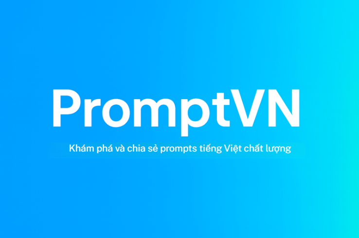

# Vietnamese Prompts - Thư viện Prompt Tiếng Việt

**[🚀 Xem Demo Live](https://promptvn.site/)** | **[✍️ Đóng góp Prompt của bạn](https://promptvn.site/contribution)**

Một thư viện mã nguồn mở, tuyển chọn các prompts tiếng Việt chất lượng cao dành cho các mô hình AI tạo sinh (Generative AI) như GPT, Gemini, Midjourney và các ứng dụng sáng tạo nội dung khác.

## Tại sao lại có dự án này?

Trong khi có rất nhiều tài nguyên prompt bằng tiếng Anh, cộng đồng người Việt vẫn thiếu một nơi tập trung, chất lượng để chia sẻ và khám phá các prompt được thiết kế riêng cho ngôn ngữ và văn hóa Việt Nam. **Vietnamese Prompts** ra đời để giải quyết vấn đề đó.

## ✨ Tính năng nổi bật

- 🇻🇳 **Tiếng Việt hoàn toàn**: Prompts được viết tự nhiên, phù hợp với ngữ cảnh Việt Nam.
- 🎨 **Đa dạng lĩnh vực**: Marketing, Giáo dục, Công nghệ, Sáng tạo, Giải trí...
- 🖼️ **Nhiều loại prompt**: Hỗ trợ `text`, `text-to-image`, và `text-to-video`.
- 🔍 **Tìm kiếm & Lọc thông minh**: Dễ dàng tìm kiếm theo nội dung, lọc theo danh mục và loại prompt.
- ❤️ **Yêu thích**: Lưu lại các prompts bạn thường dùng.
- 🌓 **Giao diện Sáng/Tối**: Tự động thay đổi theo hệ thống hoặc tùy chỉnh.
- 📱 **Responsive**: Tối ưu cho mọi thiết bị từ mobile, tablet đến desktop.
- 📋 **Sao chép nhanh**: Copy prompt chỉ với một cú nhấp chuột.

## 🙌 Đóng góp

**Bạn có một prompt hay?** Cách dễ nhất để đóng góp là qua trang web của chúng tôi!

**➡️ [Gửi prompt của bạn tại đây](https://lockman04.github.io/vietnamese-prompts/contribution)**

Nếu bạn muốn báo lỗi, yêu cầu tính năng hoặc đóng góp mã nguồn, hãy xem **[Hướng dẫn Đóng góp (CONTRIBUTING.md)](CONTRIBUTING.md)** của chúng tôi để biết chi tiết.

## 🛠️ Công nghệ sử dụng

- **Framework**: React 19 & Vite
- **Ngôn ngữ**: TypeScript
- **Styling**: Tailwind CSS
- **Icons**: Lucide React